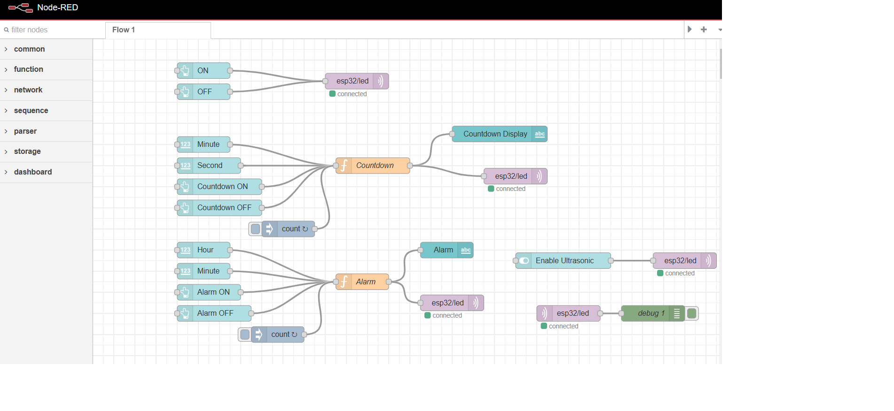
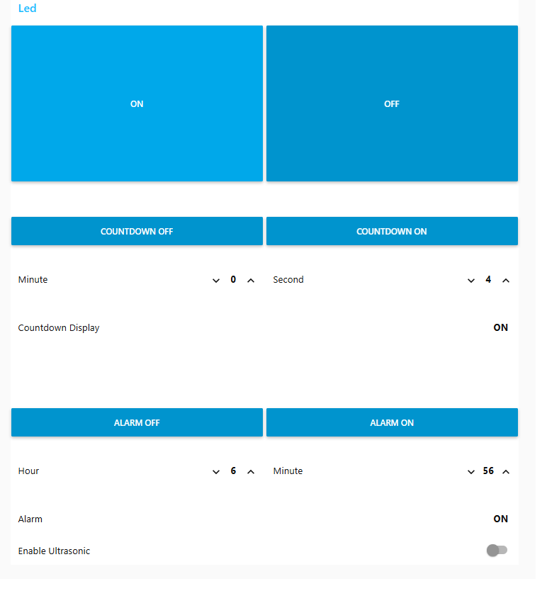
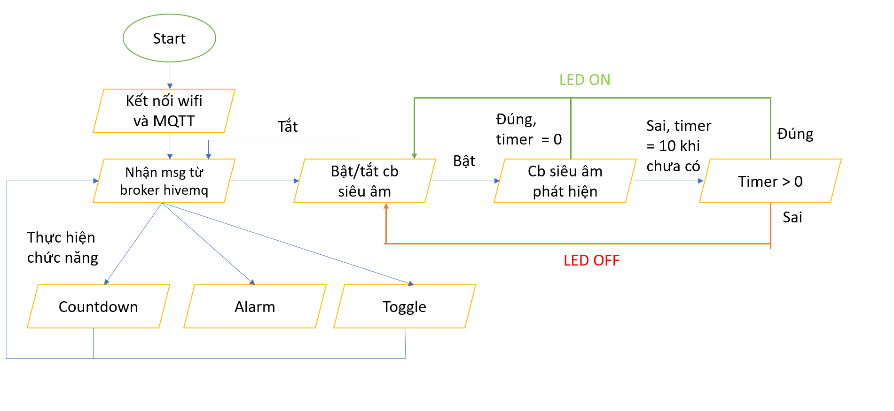
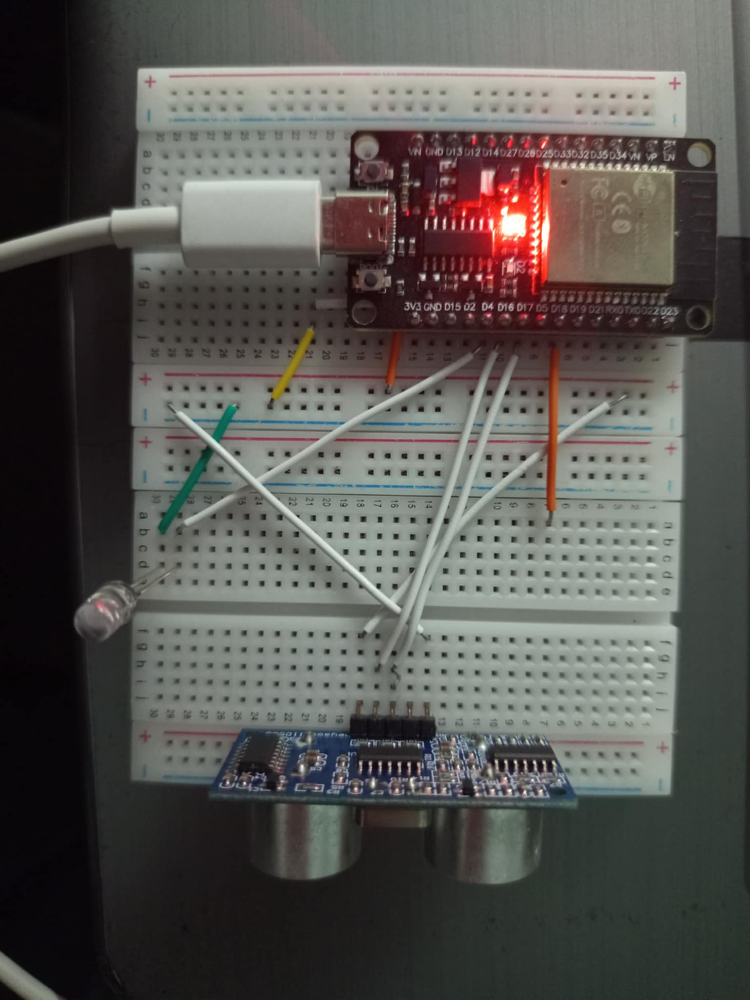
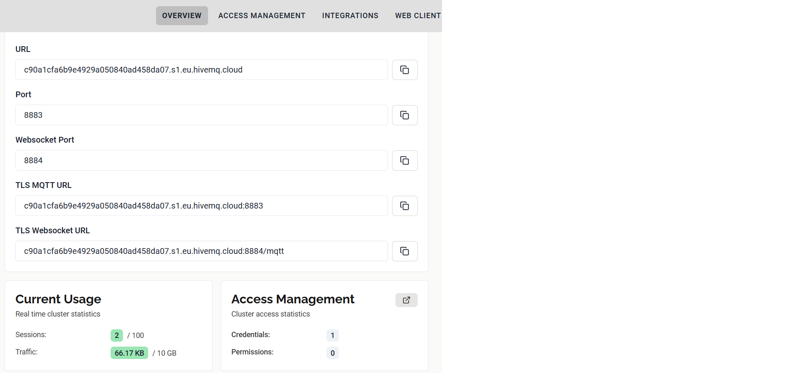

# Cuối kỳ
Họ tên: Bùi Đức Phú Anh

Nội dung: Hệ thống đèn tự động tuỳ chỉnh cho nhà

Đặt bài toán:
Cầu thang bộ là một phần không thể thiếu với bất kì cơ sở hay nhà ở nào có nhiều tầng. Việc thiếu ánh sáng ở cầu thang dù chỉ trong thời gian ngắn có thể ảnh hưởng tới sinh hoạt và gây nguy hiểm cho nguời sử dụng, đặc biệt trong trường hợp ta có nhu cầu di chuyển đồ vật không tiện sử dụng công tắc bấm. Do đó, việc có hệ thống bật tắt đèn tự động là cần thiết để đảm bảo an toàn cho người sử dụng, có thể được sử dụng trong hầu hết cơ sở hạ tầng, kinh doanh hay nhà ở và cả chung cư. Việc sử dụng timer đảm bảo việc tắt đèn chỉ xảy ra sau khi sensor không phát hiện người trong 10s liên tục. Kết hợp sử dụng MQTT và node-red dashboard để cài đặt thêm các timer hoặc đặt thời gian điều khiển đèn để đảm bảo một số phần không gian đặc biệt cần chiếu sáng trong một khoảng thời điểm nhất định trong ngày.

Node-red flow:

File mã node-red:

Ảnh chụp dashboard:

Sơ đồ thuật toán:

Ảnh chụp mạch sử dụng:

Ảnh chụp thiết lập hivemq cloud:

Sơ đồ khối:

Video kết quả (trên drive do quay video quá nặng):

Tổng hợp các tính năng:
- Bật tắt đèn dựa theo tín hiệu ultrasonic sensor
- Bật tắt đèn dựa trên countdown người dùng tuỳ chỉnh qua dashboard
- Bật tắt đèn dựa trên mốc thời gian tuỳ chỉnh qua dashboard
- Bật tắt đèn trực tiếp qua dashboard
- Bật tắt tính năng Ultrasonic sensor
- Sử dụng giao diện node-red trên điện thoại Android
- Sử dụng cloud cluster của Hivemq

Kết luận: 

Đề tài "Hệ thống đèn tự động tuỳ chỉnh cho nhà" ứng dụng công nghệ IoT để hoàn thiện một hệ thống mô phỏng việc chiếu sáng và áp dụng các tính năng thực tiễn và gần gũi. Sau đây là những kết quả mà tôi thực hiện được trong đề tài này:
+ Sử dụng cảm biến siêu âm để tương tác giữa môi trường với vi điều khiển
+ Sử dụng giao thức MQTT bằng Hivemq cloud để phát triển giao tiếp giữa thiết bị với đám mây
+ Sử dụng node-red, platformio để thiết kế và phát triển firmware một cách tối ưu
+ Sử dụng node-red dashboard để xây dựng giao diện tương tác với người dùng, giúp trải nghiệm người dùng thêm dễ dàng và hiệu quả
+ Kết hợp các ý tưởng thực tiễn để xây dựng đề tài 

Trong tương lai, đề tài có thể được mở rộng hơn với thêm các chức năng như:
+ Mở rộng quy mô quản lý chiếu sáng
+ Tối ưu hơn nữa về giao diện để sử dụng cho nhiều thiết bị
